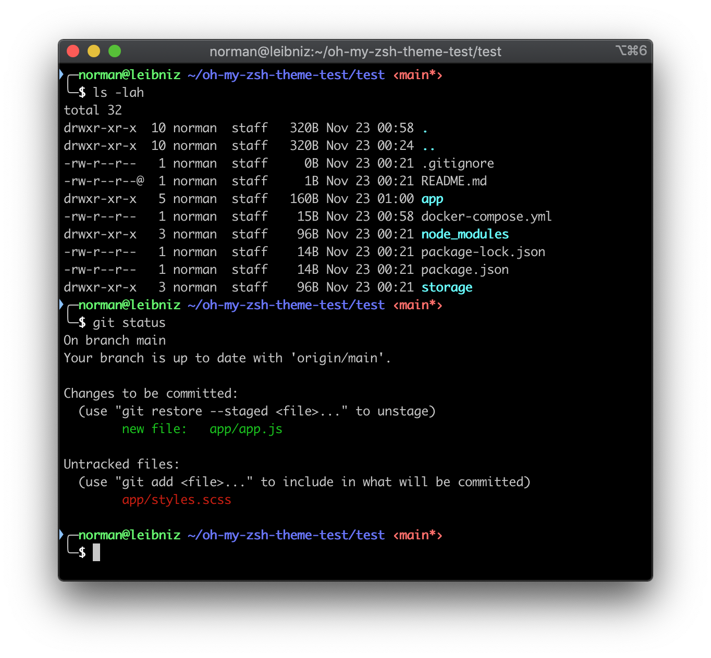
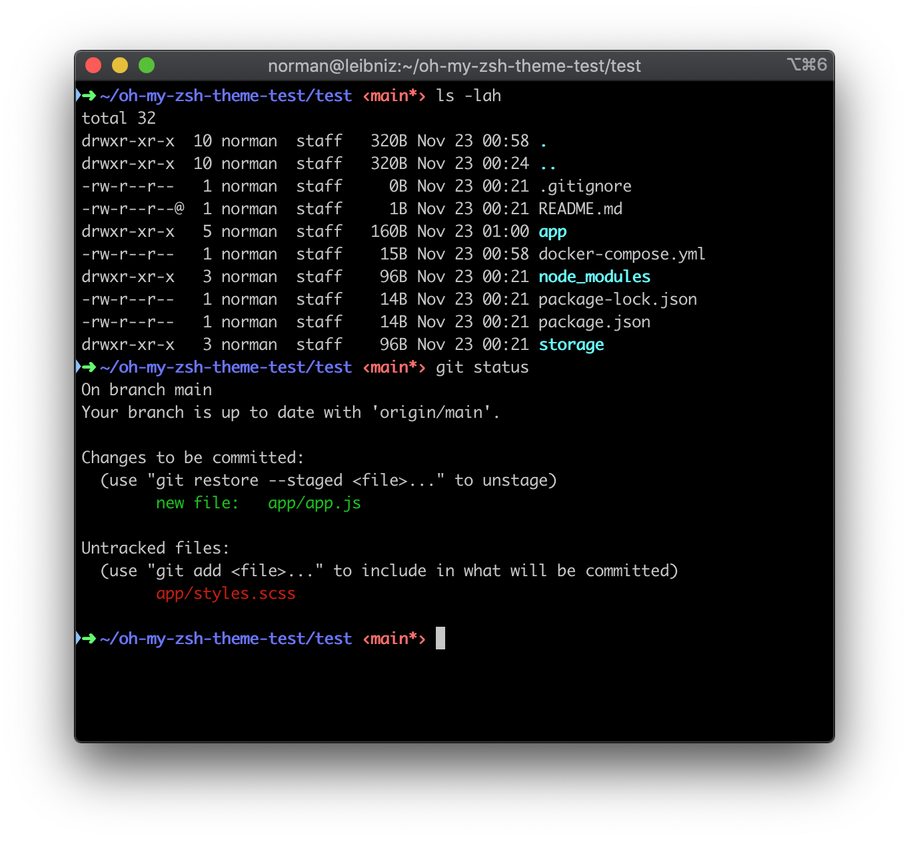

# normanius-zsh-theme

My preferred [Oh My Zsh](https://ohmyz.sh/) theme, derived from [Bira](https://github.com/ohmyzsh/ohmyzsh/blob/master/themes/bira.zsh-theme).

## Instructions

- Copy the file `normanius.zsh-theme` to `~/.oh-my-zsh/themes/`
- Set the environment variable `ZSH_THEME` to `normanius`. For example in `~/.zshrc`: `ZSH_THEME="normanius"`
- Re-source the shell: `source ~/.zshrc`

## Screenshots

- `multi_line=true` 
- `show_user=true`

--

- `multi_line=false` 
- `show_user=false`

